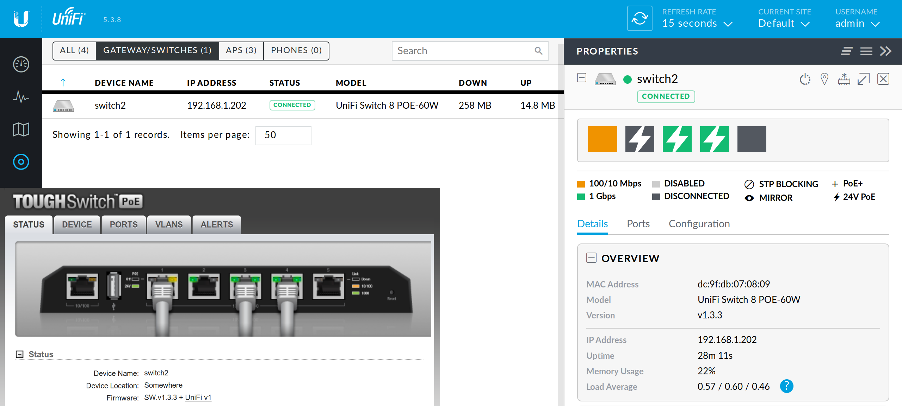

# Integrating a TOUGHswitch with a UniFi controller

The UniFi controller provides integration for some of Ubiquiti's UniFi hardware.
An important element that is often used with basic UniFi-based WiFi networks,
is the TOUGHswitch, which provides switching and power-over-ethernet capability
for the access points. This family of switches, however, do not integrate with
the UniFi controller
(and [it appears UniFi won't do so](https://community.ubnt.com/t5/UniFi-Routing-Switching/Tough-Switch-integration-with-Unifi-4-6/td-p/1191186)).
This project is an attempt to add this capability (for layer 2).




## 1. Start a local UniFi controller

For testing, it's useful to have a UniFi controller running testing. This is done
most easily using the [docker image](https://hub.docker.com/r/jacobalberty/unifi/):


```sh
$ docker pull jacobalberti/unifi
$ docker run -d --name unifi jacobalberti/unifi
$ docker inspect unifi | grep IPAddress | tail -n 1
# "IPAddress": "172.17.0.3"
```

Then visit the IP-address at port 8443 with a browser using HTTPS, in this case
that would be: https://172.17.0.3:8443/
Follow the installation wizard to get to the dashboard.


## 2. Announce

Let's see if we can announce the presence of a switch to the controller. The protocol
for this is explained in [jk-5/unifi-inform-protocol](https://github.com/jk-5/unifi-inform-protocol).
Should be as basic as sending a packet.

To send our own packet, let's use [Python](http://www.python.org). You'll need
[pycrypto](https://pypi.python.org/pypi/pycrypto) as well, later on.
Run [unifi_announce.py](unifi_announce.py):

```
$ python2 unifi_announce.py
```

When all goes well, you'll see a new device in the controller, pending adoption.
If this didn't work, you may want to review `bcast` in [unifi_config.py](unifi_config.py).
Make sure that your UniFi controller is covered by this broadcast address.

### Model identifier

Listed [here](https://community.ubnt.com/ubnt/attachments/ubnt/UniFi/194506/1/bundles.json.txt).
We're looking for an 8-port PoE switch, the `US8P150` would be the closest match.


## 3. Adopt

When the controller adopts device, it will connect to the device over SSH and run the command
`/usr/bin/syswrapper.sh`. To simulate this, we'll need to setup a new docker container running the
SSH daemon.

```
$ docker run -t -i --name ubdev ubuntu /bin/bash
# apt-get update
# apt-get install net-tools openssh-server
# echo 'KexAlgorithms diffie-hellman-group1-sha1,diffie-hellman-group-exchange-sha256' >>/etc/ssh/sshd_config
# service ssh start
# useradd -m ubnt
# passwd ubnt
(set password to ubnt)
# printf '#!/bin/sh\necho "`date +%%Y%%m%%d %%H:%%M:%%S`: $0 $@\n' >>/tmp/unifi.log\n" >/usr/bin/syswrapper.sh
# chmod a+x /usr/bin/syswrapper.sh
# touch /tmp/unifi.log && chown ubnt /tmp/unifi.log
# tail -f /tmp/unifi.log
```

Now the docker container is waiting for adoption. Press _Adopt_ in the controller, and you should
see a line appearing in the device console with a url and a hex auth key, e.g.:

```
20001010 10:10:10: /usr/bin/syswrapper.sh set-adopt http://172.17.0.3:8080/inform 123456789abcdef0123456789abcdef0
```

Open [unifi_config.py](unifi_config.py) and set `inform_url` and `auth_key` accordingly.


## 4. Inform (1st time)

Adoption succeeds when the controller receives the first inform update. This is an http request with
an encrypted body (explained [here](https://github.com/fxkr/unifi-protocol-reverse-engineering#inform)).
With the `inform_url` and `auth_key` received on adoption, this call can now be made using
[unifi_inform.py](unifi_inform.py):

```
$ python2 unifi_inform.py
```

On success, you'll see a new configuration printed to stdout, and in the controller the device will
proceed to the _Provisioning_ state. And you'll have some files in `./cfg`.


## 5. Provision

This is done by another inform update, with the `cfgversion` field set to the value as returned from
the previous inform call. The device in the controller will then be _Connected_.


## 6. Inform

**todo:** the inform update is supposed to be done every 30 seconds. It returns something like:

```
{ "_type" : "noop" , "interval" : 14 , "server_time_in_utc" : "1234567890123"}
```

Different `_type`s can be handled, as [documented here](https://github.com/mcrute/ubntmfi/blob/master/inform_protocol.md).

You can do this in the shell:
```
$ while [ 1 ]; do sleep 5; python2 unifi_inform.py; done
```

You could experiment with the data structure at the bottom of [unifi_inform.py](unifi_inform.py)
and see how the UniFi controller reacts.


## Integrating with real hardware

_Pending._

- [ ] Figure out how to gather information on a TOUGHswitch
  * network config
  * discovered mac addresses + age
  * port for each mac address (maybe not available - what then?)
  * power over ethernet config + status
  * (`mca-status` and `mca-config` may be helpful here)
- [ ] Rewrite in C (or something else to generate a small native binary)
- [ ] Cross-compile for mips (Atheron AR7240)
- [ ] Install-script


## UniFi controller log level

Edit its `data/system.properties` and add the lines

```properties
debug.device=DEBUG
debug.mgmt=DEBUG
debug.sdn=DEBUG
debug.system=DEBUG
```

then look at `log/server.log`. Hint: `docker exec -i -t unifi bash`


## Links

* UniFi protocol
 - [Help: What protocol does the controller use to communicate with the UAP?](https://help.ubnt.com/hc/en-us/articles/204976094-UniFi-What-protocol-does-the-controller-use-to-communicate-with-the-UAP-)
 - [jk-5/unifi-inform-protocol](https://github.com/jk-5/unifi-inform-protocol)
 - [fxkr/unifi-protocol-reverse-engineering](https://github.com/fxkr/unifi-protocol-reverse-engineering)
 - [nutefood/python-ubnt-discovery](https://github.com/nitefood/python-ubnt-discovery)
 - [job/ubbnut](https://github.com/jof/ubbnut)
 - [Ubiquiti inform protocol](https://github.com/mcrute/ubntmfi/blob/master/inform_protocol.md)
* UniFi controller docker image at [jacobalberti/unifi](https://hub.docker.com/r/jacobalberty/unifi/)
* [finish06/unifi-api](https://github.com/finish06/unifi-api) - utitilies to manage a UniFi controller
* [sol1/icinga-ubiquiti-mfi](https://github.com/sol1/icinga-ubiquiti-mfi) - parser for mFi `mca-dump`'s json output
* [mcrute/ubntmfi](https://github.com/mcrute/ubntmfi) - web controller for mFi hardware
* OpenWRT on [UniFi AP AC](https://wiki.openwrt.org/toh/ubiquiti/unifiac)

